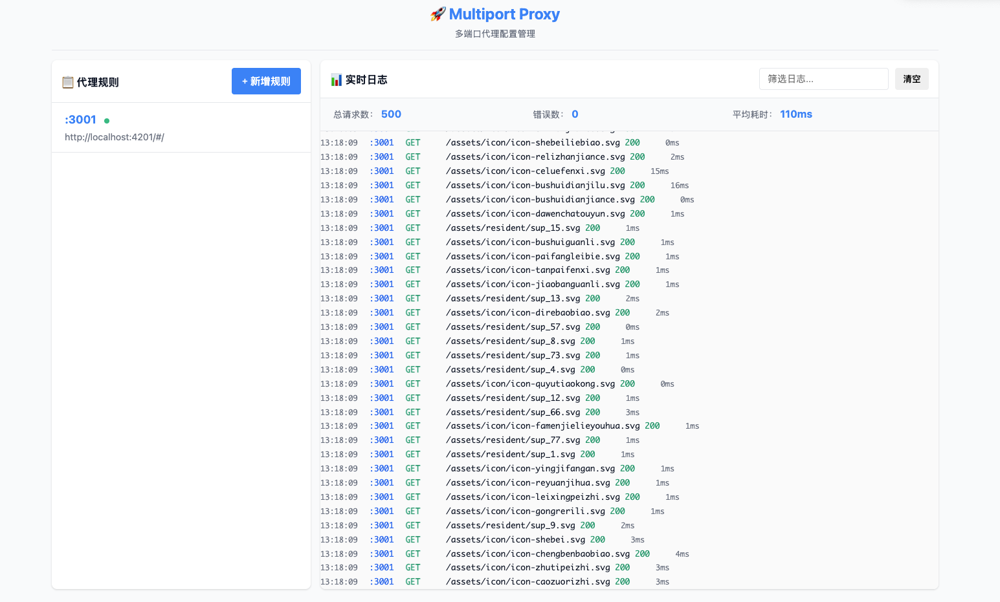

# Multiport Proxy

一个功能强大的多端口代理服务，支持动态配置和实时日志查看。



## Features

- 🚀 **Web 配置界面** - 启动时自动打开 Web UI，轻松配置代理规则
- 🔀 **多端口代理** - 支持配置多个本地端口到目标服务的映射
- ⚙️ **灵活配置** - 支持 CORS、超时、重试等可选配置
- 📊 **实时日志** - 在 Web 界面查看实时请求/响应日志，无需本地持久化
- 💾 **配置保存** - 配置自动保存，重启后自动加载
- 🎯 **零配置启动** - 开箱即用，无需复杂配置

## 快速开始

### 使用 npx（推荐）

无需安装，直接运行：

```bash
npx @jachy/multiport-proxy
```

### 全局安装

```bash
npm install -g @jachy/multiport-proxy
multiport-proxy
```

### 本地开发

```bash
# 克隆项目
git clone <your-repo-url>
cd multiport-proxy

# 安装依赖
pnpm install

# 开发模式
pnpm run dev

# 构建
pnpm run build

# 运行构建后的版本
pnpm start
```

## 项目架构

```
multiport-proxy/
├── src/
│   ├── server/
│   │   ├── proxy-server.ts          # 代理服务核心逻辑
│   │   ├── config-manager.ts        # 配置管理模块
│   │   └── logger.ts                # 日志管理模块
│   ├── web/
│   │   ├── api-routes.ts            # Web API 路由（配置/日志）
│   │   ├── ui/
│   │   │   ├── index.html           # Web 配置界面
│   │   │   ├── style.css            # 样式表
│   │   │   └── app.js               # 前端逻辑
│   │   └── middleware.ts            # Web 中间件
│   └── index.ts                     # 应用入口
├── data/
│   └── config.json                  # 配置持久化文件
├── package.json
└── tsconfig.json
```

## 核心流程

1. **启动**：应用启动时加载配置，初始化代理服务器和 Web 服务器
2. **Web UI**：自动打开浏览器访问配置页面 (localhost:8888)
3. **配置**：用户通过 Web UI 添加/编辑/删除代理规则
4. **代理**：根据配置将请求转发到目标服务
5. **日志**：实时在 Web UI 显示请求日志，支持滚动查看

## 使用流程

### 启动项目
```bash
pnpm run dev
```

### 打开配置页面
自动打开 http://localhost:8888

### 配置代理规则
1. 输入本地监听端口
2. 输入目标服务地址（如 http://localhost:3000）
3. 可选配置 CORS、超时等
4. 点击"保存"

### 查看日志
- 实时显示所有代理请求
- 支持滚动查看历史日志
- 按端口/状态码筛选

## API 接口

### 获取配置
- `GET /api/config` - 获取所有代理规则

### 保存配置
- `POST /api/config` - 保存代理规则

### 获取日志
- `GET /api/logs` - 获取实时日志（支持分页/筛选）

### 清空日志
- `DELETE /api/logs` - 清空所有日志

## 配置文件格式

```json
{
  "rules": [
    {
      "id": "rule-1",
      "localPort": 3000,
      "targetUrl": "http://api.example.com",
      "cors": {
        "enabled": true,
        "origins": ["*"]
      },
      "timeout": 30000,
      "retries": 0,
      "enabled": true
    }
  ]
}
```

## 开发要求

- Node.js >= 16
- TypeScript
- Express.js (Web 服务器)
- http-proxy (代理库)
- React/Vue/Vanilla JS (前端)

## 许可证

ISC
